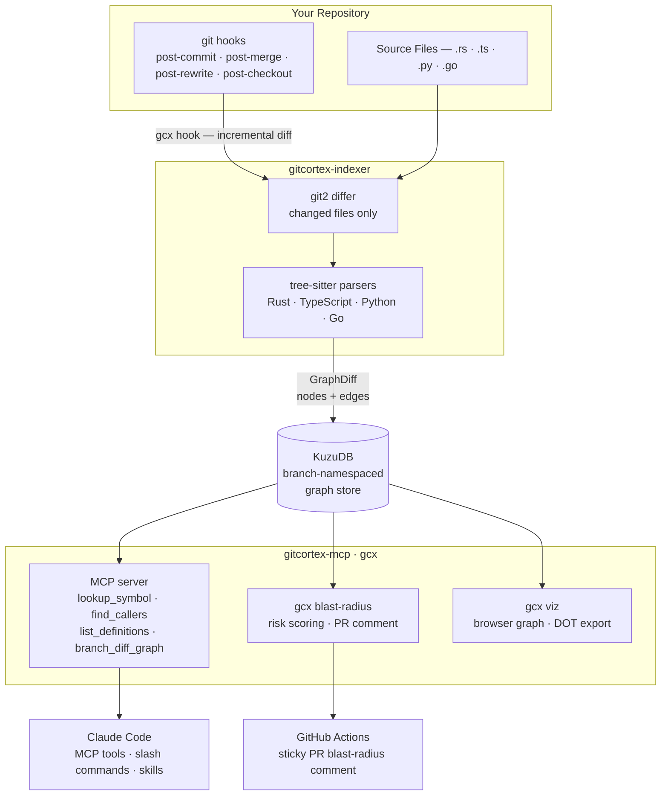

# GitCortex

A local-first, branch-aware code knowledge graph for Git repositories. GitCortex (`gcx`) indexes your codebase incrementally on every commit using tree-sitter AST parsing, persists the graph in an embedded KuzuDB database, and exposes it to AI coding assistants via an MCP server — in Cursor, Claude Code, Windsurf, GitHub Copilot, and Google Antigravity.

---

## Why

When you ask an AI editor to work on a large codebase, it either scans dozens of files to build context (burning tokens) or misses the bigger picture entirely. There's no middle ground.

GitCortex gives your AI editor a pre-built, queryable call graph of your repo — functions, structs, traits, interfaces, call relationships, inheritance — so instead of reading raw source files it can ask precise questions like "what calls this function?" or "what implements this trait?" and get structured answers instantly.

| | GitCortex v0.2 | Others |
|---|---|---|
| **MCP tools** | 12, each with real query depth | 4–16 (many shallow grep wrappers) |
| **Languages** | 5 with full edge coverage (Rust, Python, TS/JS, Go, Java) | Often 1–2, or broad but shallow |
| **IDE support** | Cursor, Claude Code, Windsurf, Copilot, Antigravity | Usually Claude Code only |
| **Index freshness** | Automatic on every `git commit / merge / rebase / checkout` | Manual re-run |
| **Branch graphs** | Per-branch, instant switch — no re-index | One graph per repo |
| **Install time** | `cargo install gitcortex` + `gcx init` — under 2 minutes | Varies |

> **One sentence**: GitCortex is the knowledge graph that stays current without you thinking about it — and works in the editor you already use.

---

## How it works

1. `gcx init` installs four git hooks and runs an initial full index.
2. On every local HEAD change the hook fires, diffs only the changed files, and updates the graph in under 500ms.
3. `gcx serve` starts an MCP server on stdio so Claude Code (or any MCP client) can query the graph.
4. `gcx viz` opens an interactive force-directed graph in your browser.

The graph is namespaced per branch — switching branches instantly gives you the graph for that branch with no re-indexing.

---

## Requirements

- Git
- Rust 1.80+ (only needed for source installs — pre-built binaries require nothing)

---

## Installation

**macOS / Linux — pre-built binary (no Rust required):**

```bash
curl --proto '=https' --tlsv1.2 -LsSf \
  https://github.com/bharath03-a/GitCortex/releases/latest/download/gcx-installer.sh | sh
```

> Pre-built binaries for macOS (arm64/x86_64) and Linux (x86_64/aarch64) are published
> automatically on every release via GitHub Releases.
> Windows users should build from source (see below) — a prebuilt binary will ship in a future release.

**Cargo (from crates.io):**

```bash
cargo install gitcortex
```

**Cargo (from git — works before crates.io publish):**

```bash
cargo install --git https://github.com/bharath03-a/GitCortex --bin gcx
```

**Build from source:**

```bash
git clone https://github.com/bharath03-a/GitCortex
cd GitCortex
cargo build --release
./target/release/gcx --help
```

---

## Quick start

```bash
cd your-repo
gcx init
```

That installs the git hooks and indexes the current branch. Every subsequent commit updates the graph automatically.

---

## Commands

### `gcx init`

Installs four git hooks, runs the initial full index, registers the MCP server in the detected editor(s), and writes `.gitcortex/AGENT_GUIDE.md` as a universal context file.

```bash
gcx init                      # auto-detects editor(s) from environment
gcx init --editor cursor      # explicit target: claude, cursor, windsurf, copilot, antigravity
gcx init --editor all         # write configs for every supported editor
gcx init --ci                 # also writes .github/workflows/gcx-blast-radius.yml
```

Output:
```
GitCortex initialised  (820ms)
  Graph:     2 141 nodes | 5 328 edges
  Hooks:     4 git hooks installed
  Editors:   Cursor, Claude Code (auto-detected)
  Universal: .gitcortex/AGENT_GUIDE.md
```

| Editor | Files written |
|--------|--------------|
| Claude Code | `.claude/hooks/`, `.claude/settings.json`, `.claude/skills/`, `.claude/commands/`, `~/.claude.json` |
| Cursor | `.cursor/rules/gitcortex.mdc`, `.cursor/mcp.json` |
| Windsurf | `.windsurfrules`, `~/.codeium/windsurf/mcp_config.json` |
| Copilot | `.github/copilot-instructions.md` |
| Antigravity | `~/.antigravity/mcp.json` |

### `gcx hook`

Called automatically by the git hooks — you rarely invoke this directly.

```bash
gcx hook                   # post-commit / post-merge / post-rewrite
gcx hook --branch-switch   # post-checkout (no re-index, just updates branch pointer)
```

### `gcx serve`

Starts the MCP server on stdio. Wire this up in your `.mcp.json` to give Claude Code access to the knowledge graph.

```bash
gcx serve
```

### `gcx query`

One-shot CLI queries for manual inspection.

```bash
gcx query lookup-symbol MyStruct
gcx query find-callers process_request --branch main
gcx query list-definitions src/lib.rs
```

### `gcx viz`

Visualise the knowledge graph.

```bash
gcx viz                            # open interactive browser UI (default port 5678)
gcx viz --port 9000                # custom port
gcx viz --branch feat/auth         # visualise a different branch
gcx viz --format dot > graph.dot   # export Graphviz DOT to stdout
dot -Tsvg graph.dot -o graph.svg   # render with Graphviz
```

The browser UI is built on **Cytoscape.js** with a Catppuccin dark theme. Features:
- **Community detection** — nodes grouped by label-propagation clusters, each cluster shaded a distinct fill
- **Node sizing** by LOC (lines of code); **edge colour** by edge kind
- **Filter rail** — NodeKind toggles, EdgeKind toggles, visibility (pub / pub(crate) / private), file list, async/unsafe flag toggles
- **Search bar** — fuzzy match by name or qualified name, ↑/↓/Enter keyboard navigation
- **Inspector panel** — callers, callees, and uses/implements lists with click-to-navigate
- **Trace path** — type any target symbol; BFS path highlighted with animation
- **Layout switcher** — Force (cose), Concentric, Tree (breadthfirst)

### `gcx blast-radius`

Show which callers are affected by changes between two branches. Powers the PR comment bot.

```bash
gcx blast-radius --base main --head feat/auth
gcx blast-radius --base main --head feat/auth --depth 3
gcx blast-radius --base main --head feat/auth --format github-comment
gcx blast-radius --base main --head feat/auth --format json
```

Example output (`--format text`):
```
Blast Radius Report
────────────────────────────────────────────────────
  feat/auth → main
  Changed: 2  |  Affected: 8  |  Risk: MEDIUM
────────────────────────────────────────────────────
Changed nodes:
  function    validate_token               src/auth.rs:23
  method      build_claims                 src/auth.rs:54

Affected callers:
  [hop 1]  function    handle_request      src/handler.rs:8
  [hop 1]  function    middleware_chain    src/middleware.rs:3
  [hop 2]  function    router              src/main.rs:12
  ...
```

### `gcx export`

Generates `.gitcortex/context.md` — a readable Markdown codebase map organized by file with hierarchical struct→method containment. Once generated, the git hook keeps it fresh after every commit.

```bash
gcx export                   # writes .gitcortex/context.md for current branch
gcx export --branch feat/auth
```

Example output:
```markdown
# Codebase Map

> Branch: `main` · 312 definitions · SHA: `abc1234`

## src/auth.rs

- `pub struct AuthConfig` :5
  - `pub fn from_env` :10
  - `pub fn is_valid` :20
- `pub async fn validate_token` :30

## src/handler.rs

- `pub fn handle_request` :8
```

Commit `.gitcortex/context.md` to give teammates (and Claude) instant codebase context without an MCP server.

### `gcx status`

Show node and edge counts for the current branch.

```bash
gcx status
gcx status --branch feat/auth
```

```
branch:     main
last sha:   abc1234...
nodes:      312
  function     80
  method       69
  struct       22
  ...
edges:      847
  calls        514
  contains     246
  ...
```

### `gcx clean`

Wipe the graph store for this repo so the next `gcx init` or commit triggers a full re-index.

```bash
gcx clean
```

---

### CI / PR blast radius bot

```bash
gcx init --ci
```

This writes `.github/workflows/gcx-blast-radius.yml`. On every pull request it runs `gcx blast-radius` and posts the result as a sticky PR comment using the `github-comment` format.

---

## MCP integration

`gcx init` registers the MCP server in `~/.claude.json` — no per-project config needed. The server is available in every Claude Code session on this machine automatically.

### Available MCP tools

| Tool | Description |
|---|---|
| `lookup_symbol` | Find all nodes matching a name across the codebase |
| `find_callers` | All functions that call a given function (backward trace) |
| `find_callees` | All functions called by a given function (forward trace, configurable depth) |
| `list_definitions` | All definitions in a source file ordered by line |
| `find_implementors` | All structs/classes that implement a trait or interface |
| `trace_path` | Every call path between two symbols (up to 6 hops) |
| `list_symbols_in_range` | Symbols whose span overlaps a file + line range |
| `find_unused_symbols` | Symbols with zero callers — dead code candidates |
| `get_subgraph` | All nodes + edges within N hops of a seed symbol (in/out/both) |
| `branch_diff_graph` | Nodes added or removed between two branches |
| `detect_changes` | Changed symbols + blast radius vs a base branch |
| `symbol_context` | Callers, callees, and used-by for a symbol |

All tools accept an optional `branch` parameter (defaults to `"main"`).

### Claude Code slash commands

`gcx init` installs four slash commands into `.claude/commands/gcx/` that are immediately available in Claude Code:

| Command | What it does |
|---|---|
| `/gcx-lookup <name>` | Find all definitions matching a name |
| `/gcx-callers <name>` | Find all callers of a function |
| `/gcx-file <path>` | List all definitions in a file |
| `/gcx-blast-radius` | Show blast radius of changes vs main |

---

## Configuration

### `.gitcortex/config.toml`

Committed to the repo and shared with your team.

```toml
[index]
languages = ["rust", "typescript", "python", "go"]
max_file_size_kb = 500

[lld]
enabled = false         # pass-2 LLD annotation (v0.2)

[store]
backend = "local"       # local only in v0.1; remote backend planned
```

### `.gitcortex/ignore`

`.gitignore`-syntax patterns for files to exclude from indexing.

```gitignore
target/
build/
**/*.generated.rs
**/*.pb.rs
```

---

## Graph schema

### Node kinds

| Kind | Languages | Description |
|---|---|---|
| `File` | all | Source file |
| `Module` | all | `mod foo { }`, Python module, Go package |
| `Struct` | Rust/Go/TS/Java | `struct Foo`, `class Foo` |
| `Enum` | all | `enum Bar` |
| `Trait` | Rust/Python | `trait Baz`, `Protocol` |
| `Interface` | TS/Go/Java | `interface Foo`, structural interface |
| `TypeAlias` | Rust/TS/Python | `type Alias = ...` |
| `Function` | all | Free-standing function |
| `Method` | all | Method inside a class / impl block |
| `Constant` | all | `const` / `static` |
| `Macro` | Rust | `macro_rules!` or proc-macro |
| `Property` | TS/Python | Class property, `@property` |
| `Annotation` | Java | `@interface` annotation type |
| `EnumMember` | all | Variant inside an enum |

### Edge kinds

| Kind | Description |
|---|---|
| `Contains` | Parent–child: `File→Module`, `Struct→Method` |
| `Calls` | Resolved call site: `Function→Function` |
| `Implements` | `impl Trait for Struct`, class implements interface |
| `Inherits` | `extends` / embedded struct / sealed permits |
| `Uses` | Type appears as parameter or return type |
| `Imports` | `use path::to::Thing`, `import` |
| `Throws` | Java `throws` clause → exception type |
| `Annotated` | Node decorated by `#[attr]`, `@decorator`, `@annotation` |

### Node metadata flags

Every node carries: `loc`, `visibility` (Pub / PubCrate / Private), `is_async`, `is_unsafe`, `is_static`, `is_abstract`, `is_final`, `is_const`, `is_property`, `is_generator`, and `generic_bounds`.

---

## Data storage

The graph database is stored locally and never committed:

```
~/.local/share/gitcortex/{repo_id}/
    graph.kuzu       # KuzuDB database (all branches, namespaced by table prefix)
    main.sha         # last indexed SHA for branch "main"
    feat__auth.sha   # last indexed SHA for branch "feat/auth"
```

---

## Architecture



The `GraphStore` trait is the extensibility boundary — the local KuzuDB backend can be swapped for a remote backend without touching the indexer or MCP layer.

---

## License

MIT
