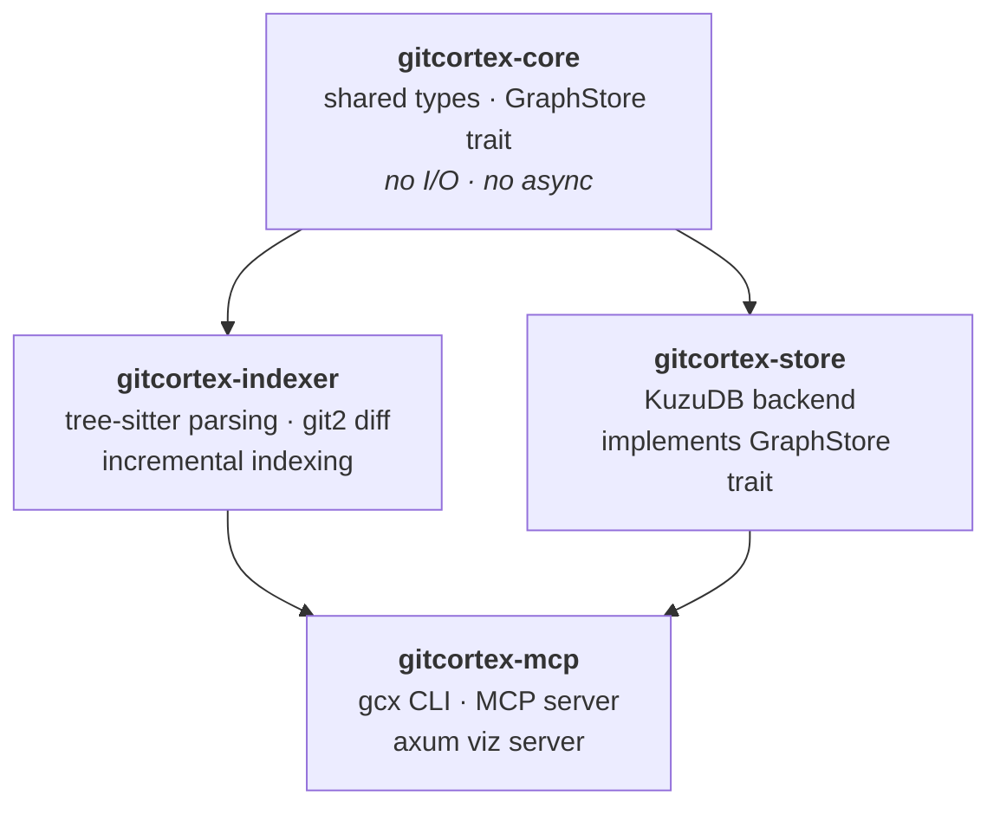

# GitCortex

A local-first, branch-aware code knowledge graph for Git repositories. GitCortex (`gcx`) indexes your codebase incrementally on every commit using tree-sitter AST parsing, persists the graph in an embedded KuzuDB database, and exposes it to AI coding assistants via an MCP server.

---

## Why

When you ask Claude Code to work on a large codebase, it either scans dozens of files to build context (burning tokens) or misses the bigger picture entirely. There's no middle ground.

GitCortex gives Claude a pre-built, queryable map of your repo — functions, structs, traits, call relationships, file structure — so instead of reading raw source files it can ask precise questions like "what calls this function?" or "what's defined in this file?" and get structured answers instantly. You get better context at a fraction of the token cost.

---

## How it works

1. `gcx init` installs four git hooks and runs an initial full index.
2. On every local HEAD change the hook fires, diffs only the changed files, and updates the graph in under 500ms.
3. `gcx serve` starts an MCP server on stdio so Claude Code (or any MCP client) can query the graph.
4. `gcx viz` opens an interactive force-directed graph in your browser.

The graph is namespaced per branch — switching branches instantly gives you the graph for that branch with no re-indexing.

---

## Requirements

- Rust 1.80+
- Git

---

## Installation

```bash
cargo install --git https://github.com/bharath03-a/GitCortex --bin gcx
```

Cargo clones, builds in release mode, and places `gcx` in `~/.cargo/bin/` — already in `$PATH` for any Rust installation. To upgrade later:

```bash
cargo install --git https://github.com/bharath03-a/GitCortex --bin gcx --force
```

**Build from source:**

```bash
git clone https://github.com/bharath03-a/GitCortex
cd gitcortex
cargo build --release
./target/release/gcx --help
```

---

## Quick start

```bash
cd your-repo
gcx init
```

That installs the git hooks and indexes the current branch. Every subsequent commit updates the graph automatically.

---

## Commands

### `gcx init`

Installs four git hooks into `.git/hooks/` and runs the initial full index.

```bash
gcx init
```

### `gcx hook`

Called automatically by the git hooks — you rarely invoke this directly.

```bash
gcx hook                   # post-commit / post-merge / post-rewrite
gcx hook --branch-switch   # post-checkout (no re-index, just updates branch pointer)
```

### `gcx serve`

Starts the MCP server on stdio. Wire this up in your `.mcp.json` to give Claude Code access to the knowledge graph.

```bash
gcx serve
```

### `gcx query`

One-shot CLI queries for manual inspection.

```bash
gcx query lookup-symbol MyStruct
gcx query find-callers process_request --branch main
gcx query list-definitions src/lib.rs
```

### `gcx viz`

Visualise the knowledge graph.

```bash
gcx viz                            # open interactive browser UI (default port 5678)
gcx viz --port 9000                # custom port
gcx viz --branch feat/auth         # visualise a different branch
gcx viz --format dot > graph.dot   # export Graphviz DOT to stdout
dot -Tsvg graph.dot -o graph.svg   # render with Graphviz
```

The browser UI is fully self-contained (no CDN) with a dark theme, force-directed layout, pan/zoom, and a click-to-inspect panel.

---

## MCP integration

Add to your `.mcp.json`:

```json
{
  "mcpServers": {
    "gitcortex": {
      "command": "gcx",
      "args": ["serve"]
    }
  }
}
```

### Available MCP tools

| Tool | Description |
|---|---|
| `lookup_symbol` | Find all nodes matching a name across the codebase |
| `find_callers` | Find all functions that call a given function |
| `list_definitions` | List all definitions in a source file ordered by line |
| `branch_diff_graph` | Show nodes added or removed between two branches |

All tools accept an optional `branch` parameter (defaults to `"main"`).

---

## Configuration

### `.gitcortex/config.toml`

Committed to the repo and shared with your team.

```toml
[index]
languages = ["rust"]    # v0.1 supports rust; v0.2 will add typescript, python
max_file_size_kb = 500

[lld]
enabled = false         # pass-2 LLD annotation (v0.2)

[store]
backend = "local"       # local only in v0.1; remote backend planned
```

### `.gitcortex/ignore`

`.gitignore`-syntax patterns for files to exclude from indexing.

```gitignore
target/
build/
**/*.generated.rs
**/*.pb.rs
```

---

## Graph schema

### Node kinds

| Kind | Description |
|---|---|
| `file` | Source file |
| `module` | `mod foo { }` |
| `struct` | `struct Foo { }` |
| `enum` | `enum Bar { }` |
| `trait` | `trait Baz { }` |
| `type_alias` | `type Alias = ...` |
| `function` | Free-standing `fn` |
| `method` | `fn` inside an `impl` block |
| `constant` | `const` / `static` |
| `macro` | `macro_rules!` or proc-macro |

### Edge kinds

| Kind | Description |
|---|---|
| `contains` | Parent–child: `File→Module`, `Struct→Method` |
| `calls` | Resolved call site: `Function→Function` |
| `implements` | `impl Trait for Struct` → `Struct→Trait` |
| `uses` | Type appears as parameter or return type |
| `imports` | `use path::to::Thing` |

---

## Data storage

The graph database is stored locally and never committed:

```
~/.local/share/gitcortex/{repo_id}/{branch}/
    graph.kuzu    # KuzuDB database for this branch
    last_sha      # last indexed commit SHA
```

---

## Architecture



The `GraphStore` trait is the extensibility boundary — the local KuzuDB backend can be swapped for a remote backend without touching the indexer or MCP layer.

---

## License

MIT
