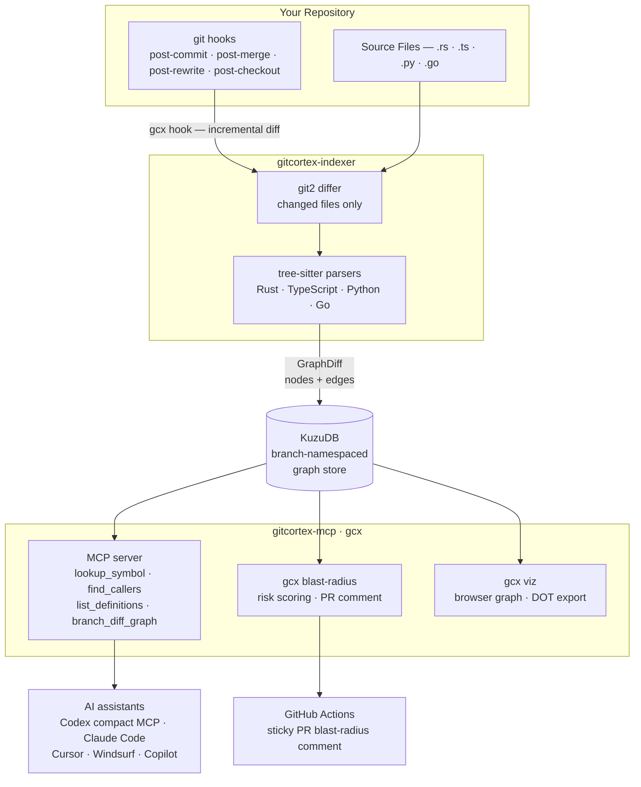

<p align="center">
  <picture>
    <source media="(prefers-color-scheme: dark)"  srcset="assets/logo-wordmark-dark.svg">
    <source media="(prefers-color-scheme: light)" srcset="assets/logo-wordmark.svg">
    
  </picture>
</p>

<p align="center">A local-first, branch-aware <strong>code knowledge graph</strong> for Git repositories.</p>

[](LICENSE)
[](https://crates.io/crates/gitcortex)
[](https://www.npmjs.com/package/gitcortex)
[](https://pypi.org/project/gitcortex/)
[](https://github.com/bharath03-a/GitCortex/actions/workflows/ci.yml)

GitCortex (`gcx`) indexes your codebase incrementally on every commit using tree-sitter AST parsing, persists the graph in an embedded KuzuDB database, and exposes it to AI coding assistants via an MCP server — in Codex, Claude Code, Cursor, Windsurf, GitHub Copilot, and Google Antigravity.

```bash
cargo install gitcortex   # or: npm i -g gitcortex · pip install gitcortex
cd your-repo && gcx init  # index + install hooks + register your editor
```

**Contents:** [Why](#why) · [Demo](#demo) · [How it works](#how-it-works) · [Install](#installation) · [Quick start](#quick-start) · [Commands](#commands) · [Languages](#supported-languages) · [MCP](#mcp-integration) · [Graph schema](#graph-schema) · [Benchmark](#benchmark) · [Architecture](#architecture) · [Limitations & roadmap](#limitations--roadmap) · [Contributing](#contributing)

---

## Why

When you ask an AI editor to work on a large codebase, it either scans dozens of files to build context (burning tokens) or misses the bigger picture entirely. There's no middle ground.

GitCortex gives your AI editor a pre-built, queryable call graph of your repo — functions, structs, traits, interfaces, call relationships, inheritance — so instead of reading raw source files it can ask precise questions like "what calls this function?" or "what implements this trait?" and get structured answers instantly.

### Highlights

- **MIT licensed** — commercial-friendly.
- **Zero runtime dependencies** — single static binary, no Node.js / Python runtime required.
- **5 languages** — Rust, Python, TypeScript/JavaScript, Go, Java ([coverage matrix](#supported-languages)).
- **Auto-indexing on every git op** — incremental, sub-500 ms on changed files; a full index of a 520k-LOC repo (Django) takes ~4 s.
- **Per-branch graphs** — switching branches is instant, no re-index.
- **Wiki, search, tour, blast-radius** — built-in discovery surface for AI assistants and humans.
- **Works in Codex, Claude Code, Cursor, Windsurf, GitHub Copilot, Google Antigravity** via MCP.
- **38 % fewer raw Codex tokens across 5 OSS repos** — measured with real `codex exec --json` usage across Rust, Python, TypeScript, Go, and Java; targeted graph questions save the most context (see [benchmark below](#benchmark)).
- **`gcx` single-dispatch MCP tool** — one compact schema covers all graph operations, cutting per-turn context overhead vs. loading 22 separate tool schemas.
- **Six viz formats** — WebGL Cosmograph UI, self-contained HTML, SVG, DOT, GraphML, Neo4j Cypher.

---

## Demo

<!-- VIDEO_SLOT
     Drop your recording here. Two supported shapes:

       1. GitHub-uploaded asset:
          https://github.com/user-attachments/assets/<id>

       2. Local file checked in under docs/ (preferred for repeatability):

       https://github.com/bharath03-a/GitCortex/assets/PLACEHOLDER/demo.mp4
-->

> _Demo video coming soon — see `docs/demo.mp4` once recorded._

---

## Benchmark

We run real assistant sessions twice on the same questions — once with normal source search/read, once with GitCortex graph access — and record the assistant-reported token usage. No chars/4 proxy.

| Question                          | What it tests                                     |
| --------------------------------- | ------------------------------------------------- |
| "Find all auth-related code"      | Discovery — where the graph vs. grep matters most |
| "Give me a tour of this codebase" | Architecture overview                             |
| "If I change X, what breaks?"     | Refactor impact — honest about limits             |
| "Show everything connected to X"  | Neighbourhood — honest loss case on large hubs    |

### Real results (compact MCP, 5 repos × 4 questions = 40 sessions)

| Repo    | Language   | Baseline tokens | Graph tokens | Raw saving | Uncached saving |
| ------- | ---------- | --------------: | -----------: | ---------: | ---------------: |
| ripgrep | Rust       |         420,093 |      294,887 | **29.80 %** |       **32.41 %** |
| fastapi | Python     |         731,212 |      424,381 | **41.96 %** |       **49.88 %** |
| hono    | TypeScript |         702,055 |      381,283 | **45.69 %** |       **28.88 %** |
| cobra   | Go         |         583,299 |      361,718 | **37.99 %** |         **0.99 %** |
| gson    | Java       |         644,937 |      438,918 | **31.94 %** |       **33.70 %** |

Aggregate: `3,081,596` baseline tokens vs. `1,901,187` graph tokens — **1,180,409 tokens saved** (**38.31 % raw**, **29.86 % uncached**, geomean **1.59×**).

**What improves most:** targeted discovery and impact questions (`search_code`, `find_callers`, `get_subgraph` on bounded seeds) consistently reduce source wandering.

**Where the graph is still weak:** broad "tour this repo" questions are less reliable in smaller repos because the current `start_tour` payload is a graph walk, not a purpose-built architecture summary. That is the next obvious product improvement.

📊 **[Full interactive benchmark report →](https://htmlpreview.github.io/?https://github.com/bharath03-a/GitCortex/blob/main/docs/benchmarks/final-report.html)** — per-language breakdown, full vs. compact MCP comparison, charts, and methodology. (Source: [`docs/benchmarks/final-report.html`](docs/benchmarks/final-report.html))

### Reproducing

```bash
cargo build --release --bin gcx
# Codex compact-MCP sweep (5 languages, 4 questions)
bash docs/benchmarks/codex-sweep.sh gpt-5.4-mini 4
# Claude sweep (haiku, release-gate benchmark)
bash docs/benchmarks/real-sweep.sh
# Single Codex repo
bash docs/benchmarks/codex-harness.sh \
    https://github.com/BurntSushi/ripgrep \
    /tmp/ripgrep-codex.json gpt-5.4-mini 4
# Single Claude repo
bash docs/benchmarks/real-harness.sh \
    https://github.com/BurntSushi/ripgrep \
    /tmp/ripgrep.json claude-haiku-4-5-20251001 4
# Render HTML reports from existing JSON
python3 docs/benchmarks/real-report.py docs/benchmarks/codex-report-data \
    -o docs/benchmarks/codex-report.html
python3 docs/benchmarks/real-report.py
```

---

## How it works

1. `gcx init` installs four git hooks and runs an initial full index.
2. On every local HEAD change the hook fires, diffs only the changed files, and updates the graph in under 500ms.
3. `gcx serve` starts an MCP server on stdio so Codex, Claude Code, or any MCP client can query the graph.
4. `gcx viz` opens an interactive force-directed graph in your browser.

The graph is namespaced per branch — switching branches instantly gives you the graph for that branch with no re-indexing.

---

## Supported languages

All five languages parse into the same graph schema (nodes + edges) and work with every query, the MCP tools, and the visualizer. Coverage maturity differs by language — the table is honest about what's deep vs. still shallow.

| Language                    | Defs (fn/type/method) | Calls | Inheritance                            | Imports | Notes                                                                                                |
| --------------------------- | --------------------- | ----- | -------------------------------------- | ------- | ---------------------------------------------------------------------------------------------------- |
| **Rust**                    | ✅                    | ✅    | ✅ traits/impls                        | ✅      | Reference implementation; deepest coverage.                                                          |
| **Python**                  | ✅                    | ✅    | ✅ base classes                        | ✅      | Decorators, async, generators, nested classes, properties, module-level bindings.                    |
| **TypeScript / JavaScript** | ✅                    | ✅    | ✅ extends/implements                  | ✅      | Generics, arrow-fn consts, type aliases, getters/setters. Visibility from `export`.                  |
| **Go**                      | ✅                    | ✅    | ◑ embedding                            | ✅      | Methods bind to receiver types. Structural interface satisfaction is **not** inferred (see roadmap). |
| **Java**                    | ✅                    | ✅    | ✅ extends/implements (incl. generics) | ✅      | Member annotations + fields not yet modeled (see roadmap).                                           |

Call resolution is **syntactic** (no full type inference): a call to a name with more than a handful of same-named definitions is treated as ambiguous and left unlinked rather than fanned out to all of them. This keeps the graph precise and the index fast.

Adding a language is a self-contained task — implement one `LanguageParser` in `gitcortex-indexer`. See [CONTRIBUTING.md](CONTRIBUTING.md).

---

## Requirements

- Git
- Rust 1.80+ (only needed for source installs — pre-built binaries require nothing)

---

## Installation

**Direct binary download (no package manager required):**

```bash
# macOS Apple Silicon (M1/M2/M3)
curl -LO https://github.com/bharath03-a/GitCortex/releases/latest/download/gitcortex-aarch64-apple-darwin.tar.xz
tar -xf gitcortex-aarch64-apple-darwin.tar.xz
sudo mv gcx /usr/local/bin/

# macOS Intel
curl -LO https://github.com/bharath03-a/GitCortex/releases/latest/download/gitcortex-x86_64-apple-darwin.tar.xz
tar -xf gitcortex-x86_64-apple-darwin.tar.xz
sudo mv gcx /usr/local/bin/

# Linux x86_64
curl -LO https://github.com/bharath03-a/GitCortex/releases/latest/download/gitcortex-x86_64-unknown-linux-gnu.tar.xz
tar -xf gitcortex-x86_64-unknown-linux-gnu.tar.xz
sudo mv gcx /usr/local/bin/

# Linux ARM64
curl -LO https://github.com/bharath03-a/GitCortex/releases/latest/download/gitcortex-aarch64-unknown-linux-gnu.tar.xz
tar -xf gitcortex-aarch64-unknown-linux-gnu.tar.xz
sudo mv gcx /usr/local/bin/
```

Or use the one-line installer:

```bash
curl --proto '=https' --tlsv1.2 -LsSf \
  https://github.com/bharath03-a/GitCortex/releases/latest/download/gitcortex-installer.sh | sh
```

**npm / pnpm / yarn (Node.js — no Rust required):**

```bash
npm install -g gitcortex
# or
pnpm add -g gitcortex
# or
yarn global add gitcortex
```

**pip / pipx / uv (Python — no Rust required):**

```bash
pip install gitcortex
# or (isolated, recommended for CLI tools)
pipx install gitcortex
# or
uv tool install gitcortex
```

**macOS / Linux — curl installer:**

```bash
curl --proto '=https' --tlsv1.2 -LsSf \
  https://github.com/bharath03-a/GitCortex/releases/latest/download/gcx-installer.sh | sh
```

> Pre-built binaries for macOS (arm64/x86_64) and Linux (x86_64/aarch64) are published automatically
> on every release via GitHub Releases.
>
> _Windows is not currently supported — the embedded graph store (KuzuDB 0.11.3, upstream archived)
> does not link cleanly on MSVC. We'll restore Windows support after migrating the store layer._

**Cargo (from crates.io):**

```bash
cargo install gitcortex
```

**Build from source:**

```bash
git clone https://github.com/bharath03-a/GitCortex
cd GitCortex
cargo build --release
./target/release/gcx --help
```

---

## Quick start

```bash
cd your-repo
gcx init
```

That installs the git hooks and indexes the current branch. Every subsequent commit updates the graph automatically.

---

## Commands

Every `gcx` subcommand accepts a global `--color` flag controlling ANSI output:

```bash
gcx --color auto    query lookup-symbol Foo   # default: colour only when stdout is a TTY
gcx --color always  query find-callers bar    # force colour (useful in pipes that handle ANSI)
gcx --color never   query symbol-context baz  # plain text, for scripts and CI
```

`gcx` also respects the [`NO_COLOR`](https://no-color.org) convention, `CLICOLOR=0`, and `TERM=dumb`. NodeKinds are coloured to match the WebGL viz palette: structs green, traits/constants yellow, interfaces cyan, functions blue, methods bright-blue, modules magenta — same identity wherever you read it.

### `gcx init`

Installs four git hooks, runs the initial full index, registers the MCP server in the detected editor(s), and writes `.gitcortex/AGENT_GUIDE.md` as a universal context file.

```bash
gcx init                      # auto-detects editor(s) from environment
gcx init --editor codex       # explicit target: codex, claude, cursor, windsurf, copilot, antigravity
gcx init --editor all         # write configs for every supported editor
gcx init --ci                 # also writes .github/workflows/gcx-blast-radius.yml
```

Output:

```
GitCortex initialised  (820ms)
  Graph:     2 141 nodes | 5 328 edges
  Hooks:     4 git hooks installed
  Editors:   Codex, Cursor, Claude Code (auto-detected)
  Universal: .gitcortex/AGENT_GUIDE.md
```

| Editor      | Files written                                                                                       |
| ----------- | --------------------------------------------------------------------------------------------------- |
| Claude Code | `.claude/hooks/`, `.claude/settings.json`, `.claude/skills/`, `.claude/commands/`, `~/.claude.json` |
| Codex       | `AGENTS.md`, `.codex/config.toml`                                                                   |
| Cursor      | `.cursor/rules/gitcortex.mdc`, `.cursor/mcp.json`                                                   |
| Windsurf    | `.windsurfrules`, `~/.codeium/windsurf/mcp_config.json`                                             |
| Copilot     | `.github/copilot-instructions.md`                                                                   |
| Antigravity | `~/.antigravity/mcp.json`                                                                           |

### `gcx hook`

Called automatically by the git hooks — you rarely invoke this directly.

```bash
gcx hook                   # post-commit / post-merge / post-rewrite
gcx hook --branch-switch   # post-checkout (no re-index, just updates branch pointer)
```

### `gcx serve`

Starts the MCP server on stdio. Wire this up in your assistant's MCP config to give it access to the knowledge graph.

```bash
gcx serve             # full MCP surface
gcx serve --compact   # single-dispatch `gcx` tool only; recommended for Codex/token-sensitive agents
```

### `gcx query`

One-shot CLI queries for manual inspection. The same surface is exposed to
AI assistants as MCP tools.

```bash
# Locate symbols
gcx query lookup-symbol MyStruct
gcx query search auth --limit 10              # ranked fuzzy match
gcx query list-definitions src/lib.rs

# Call graph
gcx query find-callers process_request --branch main --depth 3
gcx query find-callees handle_request
gcx query trace-path entry_point database_query
gcx query symbol-context apply_diff           # 360° view (def + callers + callees + uses)

# Discovery — new in v0.3
gcx query wiki apply_diff                     # markdown wiki page for a symbol
gcx query tour --limit 12                     # centrality-ranked global tour
gcx query tour --seed main                    # BFS-walk outward from a seed
```

### `gcx viz`

Visualise the knowledge graph.

```bash
gcx viz                                # default: WebGL Cosmograph UI on port 5678
gcx viz --port 9000                    # custom port
gcx viz --branch feat/auth             # visualise a different branch
gcx viz --format html > graph.html     # self-contained vis-network HTML, open offline
gcx viz --format svg  > graph.svg      # static SVG with kind-grouped concentric layout
gcx viz --format dot  > graph.dot      # Graphviz DOT (pipe to `dot -Tsvg ...`)
gcx viz --format graphml > graph.graphml   # importable by Gephi, yEd, Cytoscape
gcx viz --format cypher > import.cypher    # Neo4j bulk CREATE statements
```

Format choice:

| `--format`      | Output                                            | When to use                                        |
| --------------- | ------------------------------------------------- | -------------------------------------------------- |
| `web` (default) | Live Axum server, Cosmograph WebGL UI             | Interactive exploration on a running machine       |
| `html`          | Single self-contained file (vis-network from CDN) | Share via Slack/email, open offline, embed in docs |
| `svg`           | Static SVG, kind-grouped concentric layout        | Paste into Markdown/PRs/issues                     |
| `dot`           | Graphviz DOT                                      | Pipe to `dot`/`neato` for high-fidelity SVG/PNG    |
| `graphml`       | XML graph                                         | Open in Gephi / yEd / Cytoscape for analysis       |
| `cypher`        | Neo4j Cypher                                      | Push the graph into a live Neo4j instance          |

The browser UI is a React 19 + Vite + Tailwind v4 single-page app, rendered by **Cosmograph** (`@cosmos.gl/graph`) — a WebGL/GPGPU force-directed graph engine that runs the entire simulation on the GPU. The whole bundle is embedded in the `gcx` binary via `include_bytes!`, so there is no runtime dependency beyond a browser.

Features:

- **GPGPU force layout** — clusters form naturally on first paint, smooth at 60fps even on thousands of nodes
- **Three-pane shell** — FilterRail (left) · Cosmograph canvas (center) · Inspector (right) · StatusBar (bottom)
- **Density modes** in the header: `Focused` (only semantically connected nodes), `Public API` (only `pub` symbols), `Full` (all)
- **Cmd+K search palette** — fuzzy match on name and qualified_name, ↑/↓/Enter keyboard navigation, click zooms-to-node
- **Inspector tabs** — local Callers/Callees/Uses (computed client-side from the live graph), plus a **Deep Callers** tab backed by MCP `find_callers_deep` with risk scoring (LOW / MEDIUM / HIGH / CRITICAL)
- **Branch diff overlay** — pick a branch from the header dropdown; added nodes glow emerald, removed nodes glow red, with a live legend
- **NodeKind + EdgeKind filter toggles** in the left rail, with per-kind counts
- **Floating canvas controls** — zoom in/out, fit, focus selected, play/pause simulation
- **Catppuccin dark theme** with custom Tailwind v4 design tokens (`--color-void`, `--color-accent`, etc.)
- **Editor links** — clicking a node opens it in VS Code/Cursor/IDEA via `file:line` URI

### `gcx blast-radius`

Show which callers are affected by changes between two branches. Powers the PR comment bot.

```bash
gcx blast-radius --base main --head feat/auth
gcx blast-radius --base main --head feat/auth --depth 3
gcx blast-radius --base main --head feat/auth --format github-comment
gcx blast-radius --base main --head feat/auth --format json
```

Example output (`--format text`):

```
Blast Radius Report
────────────────────────────────────────────────────
  feat/auth → main
  Changed: 2  |  Affected: 8  |  Risk: MEDIUM
────────────────────────────────────────────────────
Changed nodes:
  function    validate_token               src/auth.rs:23
  method      build_claims                 src/auth.rs:54

Affected callers:
  [hop 1]  function    handle_request      src/handler.rs:8
  [hop 1]  function    middleware_chain    src/middleware.rs:3
  [hop 2]  function    router              src/main.rs:12
  ...
```

### `gcx export`

Generates `.gitcortex/context.md` — a readable Markdown codebase map organized by file with hierarchical struct→method containment. Once generated, the git hook keeps it fresh after every commit.

```bash
gcx export                          # writes .gitcortex/context.md (Markdown map)
gcx export --branch feat/auth
gcx export --format json > graph.json   # committable JSON: symbols + edges, joinable by id
gcx export --claude-md --top 40     # upsert top-N symbols into CLAUDE.md
```

- **`--format json`** — emits `{ branch, sha, symbols[], edges[] }` to stdout. Each symbol carries `id`, `name`, `qualified_name`, `kind`, `file`, `line`, `visibility`; edges reference symbol `id`s. Commit it, diff it in PRs, or consume it in CI **without the binary or the embedded DB**.
- **`--claude-md`** — upserts a compact, centrality-ranked symbol table into `CLAUDE.md` between `<!-- gcx:symbols start/end -->` markers (idempotent). Assistants get the most-referenced symbols (name → `file:line`) **pre-loaded with zero tool calls**, with a hint to fall back to the MCP tools for anything not listed.

Example output:

```markdown
# Codebase Map

> Branch: `main` · 312 definitions · SHA: `abc1234`

## src/auth.rs

- `pub struct AuthConfig` :5
  - `pub fn from_env` :10
  - `pub fn is_valid` :20
- `pub async fn validate_token` :30

## src/handler.rs

- `pub fn handle_request` :8
```

Commit `.gitcortex/context.md` to give teammates (and Claude) instant codebase context without an MCP server.

### `gcx status`

Show node and edge counts for the current branch.

```bash
gcx status
gcx status --branch feat/auth
```

```
branch:     main
last sha:   abc1234...
nodes:      312
  function     80
  method       69
  struct       22
  ...
edges:      847
  calls        514
  contains     246
  ...
```

### `gcx clean`

Wipe the graph store for this repo so the next `gcx init` or commit triggers a full re-index.

```bash
gcx clean
```

### `gcx doctor`

Diagnose setup issues: hooks installed, MCP registered, store accessible, index current.

```bash
gcx doctor
```

Example output:

```
gcx doctor

  [ok] gcx v0.4.0 on PATH (/usr/local/bin/gcx)
  [ok] git repository detected
  [ok] post-commit hook installed
  [ok] post-merge hook installed
  [ok] post-rewrite hook installed
  [ok] post-checkout hook installed
  [ok] graph store accessible  (1 842 nodes, 4 217 edges on main)
  [ok] index is current  (HEAD abc1234)
  [ok] MCP registered  (Claude Code)
  [ok] assistant configured  (Codex)
  [--] MCP not configured for Cursor  (run: gcx init --editor cursor)

All checks passed.
```

### `gcx update`

Check for a newer release and print the right update command for your install method.

```bash
gcx update
```

```
gcx update

  current version:  0.4.0
  latest version:   0.4.0
  you are up to date.

  To update (cargo):
    cargo install gitcortex
```

---

### CI / PR blast radius bot

```bash
gcx init --ci
```

This writes `.github/workflows/gcx-blast-radius.yml`. On every pull request it runs `gcx blast-radius` and posts the result as a sticky PR comment using the `github-comment` format.

---

## MCP integration

`gcx init` registers the MCP server for the detected editor(s). Use `--editor` to force one target:

```bash
gcx init --editor codex
gcx init --editor claude
gcx init --editor all
```

Codex uses the compact server by default:

```toml
[mcp_servers.gitcortex]
command = "gcx"
args = ["serve", "--compact"]
startup_timeout_sec = 30
```

Claude Code and the other editors use the full MCP surface unless you manually switch their config to `["serve", "--compact"]`.

### Available MCP tools

| Tool                    | Description                                                                                                                                                                |
| ----------------------- | -------------------------------------------------------------------------------------------------------------------------------------------------------------------------- |
| `gcx`                   | **Single-dispatch tool** — one schema covers all operations below. Pass `action` + `params` to avoid loading 22 separate schemas per turn. Preferred for token efficiency; the compact server exposes only this tool. |
| `lookup_symbol`         | Find all nodes matching a name across the codebase                                                                                                                         |
| `find_callers`          | All functions that call a given function (backward trace, capped at 25)                                                                                                    |
| `find_callees`          | All functions called by a given function (forward trace, configurable depth)                                                                                               |
| `list_definitions`      | All definitions in a source file ordered by line                                                                                                                           |
| `find_implementors`     | All structs/classes that implement a trait or interface                                                                                                                    |
| `trace_path`            | Every call path between two symbols (up to 6 hops)                                                                                                                         |
| `list_symbols_in_range` | Symbols whose span overlaps a file + line range                                                                                                                            |
| `find_unused_symbols`   | Symbols with zero callers — dead code candidates (returns top 30, full count always included)                                                                              |
| `get_subgraph`          | Nodes + edges within N hops of a seed symbol (default depth 1, capped at 30 nodes)                                                                                         |
| `branch_diff_graph`     | Nodes added or removed between two branches                                                                                                                                |
| `detect_changes`        | Changed symbols + blast radius vs a base branch                                                                                                                            |
| `symbol_context`        | Callers, callees, and used-by for a symbol                                                                                                                                 |
| `wiki_symbol`           | Markdown wiki page: signature, doc-comment, top callers/callees                                                                                                            |
| `search_code`           | Ranked fuzzy search over name + qualified path (default 10 results)                                                                                                        |
| `start_tour`            | Centrality-ranked guided tour — entry points ordered by graph importance                                                                                                   |
| `graph_stats`           | Aggregate node/edge counts (total + per-kind) — first-call orientation                                                                                                     |
| `ast_search`            | Structural search by kind, is_async, visibility, and complexity range                                                                                                      |
| `type_hierarchy`        | Supertypes and subtypes of a type in one call (both directions)                                                                                                            |
| `find_importers`        | Files/modules that import a given symbol (in-repo imports)                                                                                                                  |
| `find_type_usages`      | Functions/methods that use a type as a parameter or return type                                                                                                            |
| `module_dependencies`   | In-repo modules a module depends on (via imports)                                                                                                                          |
| `get_call_sites`        | Every call site of a function — caller plus the exact call line                                                                                                            |

All tools accept an optional `branch` parameter. Defaults to the branch active when `gcx serve` was started (auto-detected from `git symbolic-ref HEAD`).

### MCP prompts

| Prompt          | What it does                                                                                                                 |
| --------------- | ---------------------------------------------------------------------------------------------------------------------------- |
| `detect_impact` | Pre-commit impact analysis — maps a list of changed files to affected callers and scores risk LOW / MEDIUM / HIGH / CRITICAL |
| `generate_map`  | Architecture diagram — produces a Mermaid module map, key types table, and core execution flows                              |

Prompts are multi-step workflows your AI assistant executes automatically using the tools above. In Claude Code, invoke them via the prompt picker or with `/mcp__gitcortex__detect_impact`.

Compact MCP mode intentionally hides the individual tools and keeps only `gcx`; prompts may not be available in clients that only load exposed tools.

### Claude Code slash commands

`gcx init` installs four slash commands into `.claude/commands/gcx/` that are immediately available in Claude Code:

| Command               | What it does                         |
| --------------------- | ------------------------------------ |
| `/gcx-lookup <name>`  | Find all definitions matching a name |
| `/gcx-callers <name>` | Find all callers of a function       |
| `/gcx-file <path>`    | List all definitions in a file       |
| `/gcx-blast-radius`   | Show blast radius of changes vs main |

---

## Configuration

### `.gitcortex/config.toml`

Committed to the repo and shared with your team.

```toml
[index]
languages = ["rust", "typescript", "python", "go"]
max_file_size_kb = 500

[lld]
enabled = false         # pass-2 LLD annotation (v0.2)

[store]
backend = "local"       # local only in v0.1; remote backend planned
```

### `.gitcortex/ignore`

`.gitignore`-syntax patterns for files to exclude from indexing.

```gitignore
target/
build/
**/*.generated.rs
**/*.pb.rs
```

---

## Graph schema

### Node kinds

| Kind         | Languages         | Description                                                |
| ------------ | ----------------- | ---------------------------------------------------------- |
| `File`       | all               | Source file                                                |
| `Module`     | all               | `mod foo { }`, Python module, Go package                   |
| `Struct`     | Rust/Go/TS/Java   | `struct Foo`, `class Foo`                                  |
| `Enum`       | all               | `enum Bar`                                                 |
| `Trait`      | Rust/Python       | `trait Baz`, abstract base class                           |
| `Interface`  | TS/Go/Java/Python | `interface Foo`, structural interface, `Protocol` subclass |
| `TypeAlias`  | Rust/TS/Python    | `type Alias = ...`                                         |
| `Function`   | all               | Free-standing function                                     |
| `Method`     | all               | Method inside a class / impl block                         |
| `Constant`   | all               | `const` / `static`                                         |
| `Macro`      | Rust              | `macro_rules!` or proc-macro                               |
| `Property`   | TS/Python         | Class property, `@property`                                |
| `Annotation` | Java              | `@interface` annotation type                               |
| `EnumMember` | all               | Variant inside an enum                                     |

### Edge kinds

| Kind         | Description                                              |
| ------------ | -------------------------------------------------------- |
| `Contains`   | Parent–child: `File→Module`, `Struct→Method`             |
| `Calls`      | Resolved call site: `Function→Function`                  |
| `Implements` | `impl Trait for Struct`, class implements interface      |
| `Inherits`   | `extends` / embedded struct / sealed permits             |
| `Uses`       | Type appears as parameter or return type                 |
| `Imports`    | `use path::to::Thing`, `import`                          |
| `Throws`     | Java `throws` clause → exception type                    |
| `Annotated`  | Node decorated by `#[attr]`, `@decorator`, `@annotation` |

### Python indexing detail

The Python parser fully resolves the following patterns:

| Pattern                                     | NodeKind emitted      | Metadata set                             |
| ------------------------------------------- | --------------------- | ---------------------------------------- |
| `class Foo(Protocol):`                      | `Interface`           | `is_abstract = true`                     |
| `class Foo:` / `@dataclass class Foo:`      | `Struct`              | —                                        |
| `@property def bar(self):`                  | `Property`            | `is_property = true`                     |
| `@staticmethod def fn():`                   | `Method`              | `is_static = true`                       |
| `@classmethod def fn(cls):`                 | `Method`              | `is_static = true`                       |
| `async def fn():`                           | `Function` / `Method` | `is_async = true`                        |
| `def fn(): yield …`                         | `Function`            | `is_generator = true`                    |
| `async def fn(): yield …`                   | `Function`            | `is_async = true`, `is_generator = true` |
| `UPPER_SNAKE_CASE = …` at module level      | `Constant`            | —                                        |
| Nested `class Inner:` inside `class Outer:` | `Struct`              | `Contains` edge from `Outer`             |

### Node metadata flags

Every node carries: `loc`, `visibility` (Pub / PubCrate / Private), `is_async`, `is_unsafe`, `is_static`, `is_abstract`, `is_final`, `is_const`, `is_property`, `is_generator`, and `generic_bounds`.

---

## Data storage

The graph database is stored locally and never committed:

```
~/.local/share/gitcortex/{repo_id}/
    graph.kuzu       # KuzuDB database (all branches, namespaced by table prefix)
    main.sha         # last indexed SHA for branch "main"
    feat__auth.sha   # last indexed SHA for branch "feat/auth"
```

---

## Architecture



The `GraphStore` trait is the extensibility boundary — the local KuzuDB backend can be swapped for a remote backend without touching the indexer or MCP layer.

---

## Limitations & roadmap

GitCortex builds a **syntactic** graph from tree-sitter ASTs. That's deliberate — it keeps indexing fast and dependency-free — but it sets the boundaries below. Contributions toward any of these are welcome.

**Known gaps**

- **No type inference.** Call resolution matches on names, not resolved types. Calls to very common names (`get`, `save`, `__init__`) are left unlinked rather than fanned out to every same-named definition.
- **Go interface satisfaction not inferred.** Go satisfies interfaces structurally (no `implements` keyword), so `find-implementors` on a Go interface returns nothing. Embedding (`inherits`) is captured.
- **Java member annotations & fields not modeled.** `@Override` / `@SerializedName` on members and `static final` fields don't yet produce nodes/edges, so annotation-target and field-level queries are incomplete.
- **Go type-declaration signatures** render without the leading `type` keyword and struct/interface body (the type name + kind are correct).
- **Windows is unsupported** — KuzuDB 0.11.3 (upstream archived) doesn't link under MSVC. macOS (arm64/x86_64) and Linux (x86_64/aarch64) ship pre-built binaries.

**Roadmap**

- Pass-2 LLD annotation (SOLID hints, design patterns, code smells, cyclomatic complexity) — schema is already in place.
- Optional semantic search over `DefinitionText` (signatures + docstrings are already captured).
- Remote `GraphStore` backend for team-shared graphs (the trait boundary exists today).
- Deeper Java/Go modeling (fields, annotations, structural interface satisfaction).

See [open issues](https://github.com/bharath03-a/GitCortex/issues) for the live list.

---

## Contributing

Contributions are welcome — bug reports, language-coverage improvements, new MCP tools, docs.

- **Start here:** [CONTRIBUTING.md](CONTRIBUTING.md) — dev setup, build, test, and PR workflow.
- **Conduct:** [CODE_OF_CONDUCT.md](CODE_OF_CONDUCT.md).
- **Pre-commit gate:** after cloning, install the hook once: `cp hooks/pre-commit .git/hooks/pre-commit && chmod +x .git/hooks/pre-commit`. It auto-formats with `cargo fmt` (re-stages changed files) and runs `cargo clippy -D warnings` before every commit.
- **Test your changes against real repos:** `scripts/lang-smoke.sh <git-url> <symbol>` clones a repo, indexes it, exercises every query + the MCP round-trip, and prints PASS/FAIL with metrics.
- **Releasing:** [RELEASING.md](RELEASING.md).

Good first issues: add a `LanguageParser` for a new language, deepen an existing parser (see [the coverage matrix](#supported-languages)), or add an MCP tool.

---

## License

[MIT](LICENSE) © GitCortex contributors.
