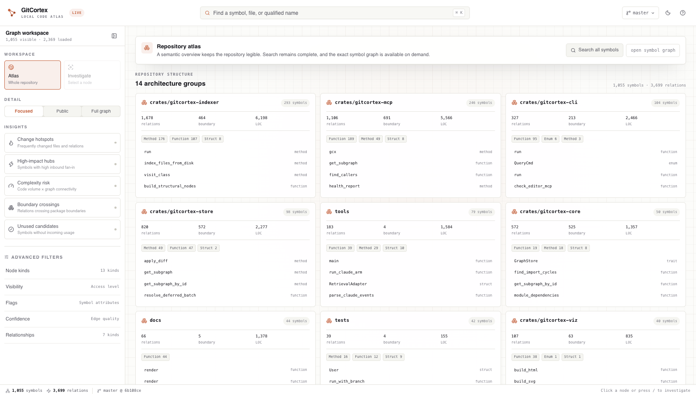
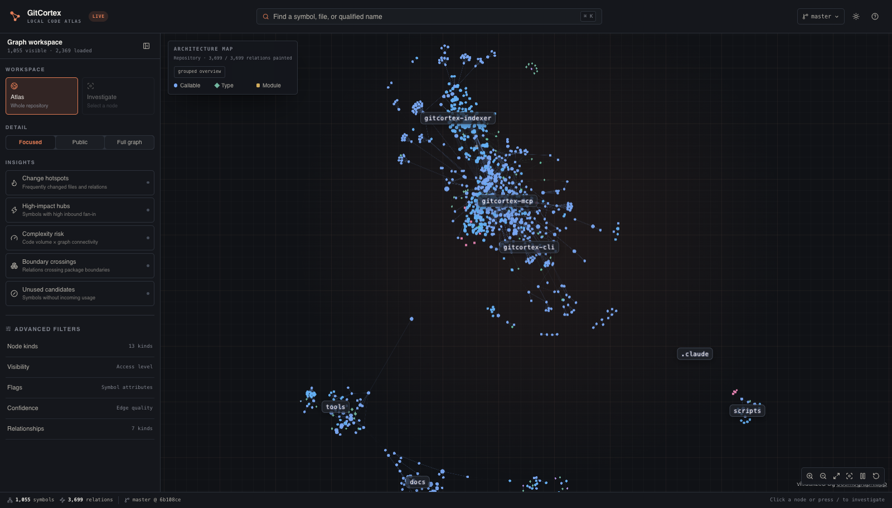
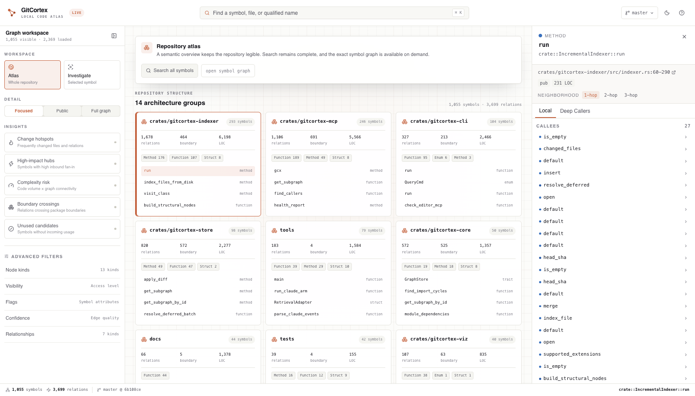
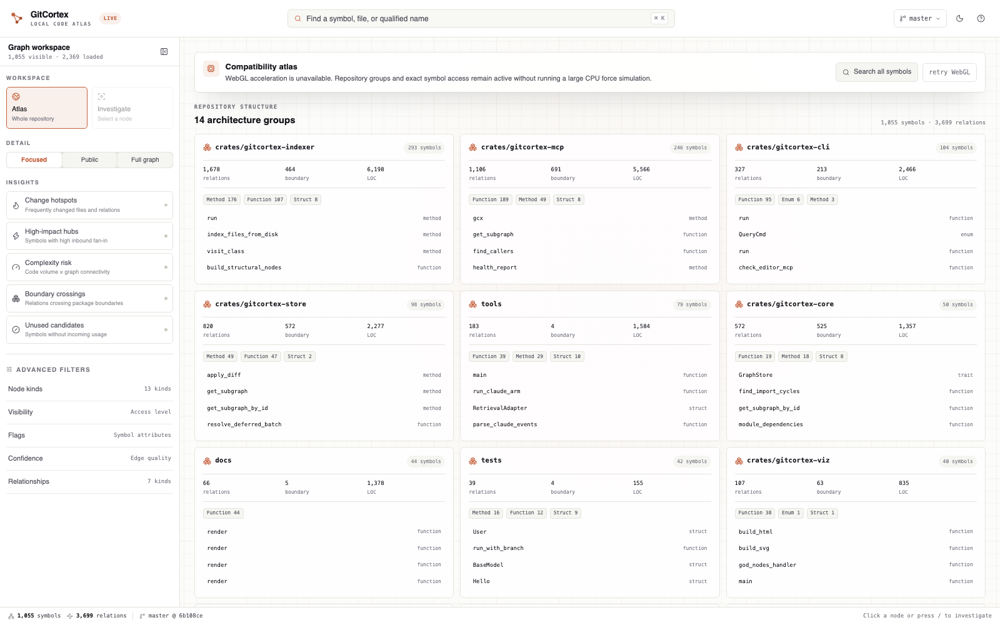

# GitCortex Viz Gallery

These screenshots come from the real embedded Viz build running against an indexed local sample repository—not a static UI mock.

## Sample and reproduction

The sample was a clean Git repository created from the GitCortex `origin/main` source tree and indexed with the PR build:

```text
2,369 indexed nodes
8,006 indexed edges
14 architecture groups in the default focused view
1,055 visible symbols and 3,699 visible relations in that view
```

The test used an isolated `XDG_DATA_HOME` so it did not read or modify the developer's normal GitCortex graph store.

```bash
# From a clean sample repository
XDG_DATA_HOME=/tmp/gitcortex-viz-sample-data gcx init --editor codex
XDG_DATA_HOME=/tmp/gitcortex-viz-sample-data gcx status
XDG_DATA_HOME=/tmp/gitcortex-viz-sample-data gcx viz --branch master --port 4179
```

## Light theme — repository atlas (default)

The default view uses semantic architecture groups instead of presenting more than 1,000 symbols as equal-weight dots. Search still covers the complete loaded graph, and the exact symbol graph is one action away.



## Dark theme — exact symbol graph

The graphite theme uses a separately tuned graph palette. The exact WebGL graph is an on-demand detail surface with bounded labels, thin contextual edges, package clustering, and a route back to the grouped overview.



## Light theme — synchronized symbol inspector

Selecting a symbol keeps its architecture group highlighted and opens exact source, neighborhood, caller-depth, and relationship evidence in the inspector.



## No-GPU compatibility atlas

With hardware-accelerated WebGL disabled, the same repository remains searchable and inspectable through the grouped compatibility atlas. GitCortex does not leave an infinite renderer spinner or attempt a large CPU force simulation.


